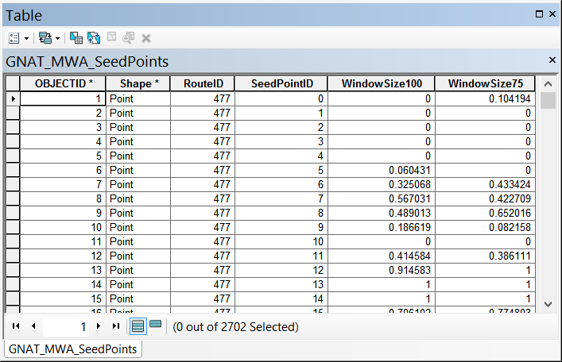

Moving Window Analysis Tool 
===========================

The moving window analysis tool calculates length based attributes over a series of user specified windows repeated at a user specified interval (Seed Point Distance). The results are reported at the center point of each window series (seed Point).

## Preprocessing Steps

1. Generate the Line Network Attribute 
2. Make sure the Line Network is Routed.

## Input Parameters

### Line Network
The Line network that contains the attributes to calculate with the moving window.

### Stream Route ID
The field that contains a unique ID for each Stream/Route. The tool will dissolve based on this ID, so as to create the longest continuous river segments for generating the Seed Points.

### Attribute Field
The Field that contains the Attribute information for the moving window calculation. Currently only BINARY fields for Confinement (i.e. `IsConfined`).

### Seed Point Distance
Distance between seed points. The first seed point is located at half the distance of the largest window size from the ends of each stream route. This is to ensure that each seed point has every window size associated with it.

### Window Sizes
Provide each window size (in meters) to be generated at each seed point.

### Output Workspace
Output File Geodatabase to store the results and intermediate data. The default is the Scratch Workspace in the Environments. 

## Outputs
All data output from this tool (results and intermediate) begin with `GNAT_MWA_`

### Seed Points
Points that contain the calculated attribute for each window size.
 

